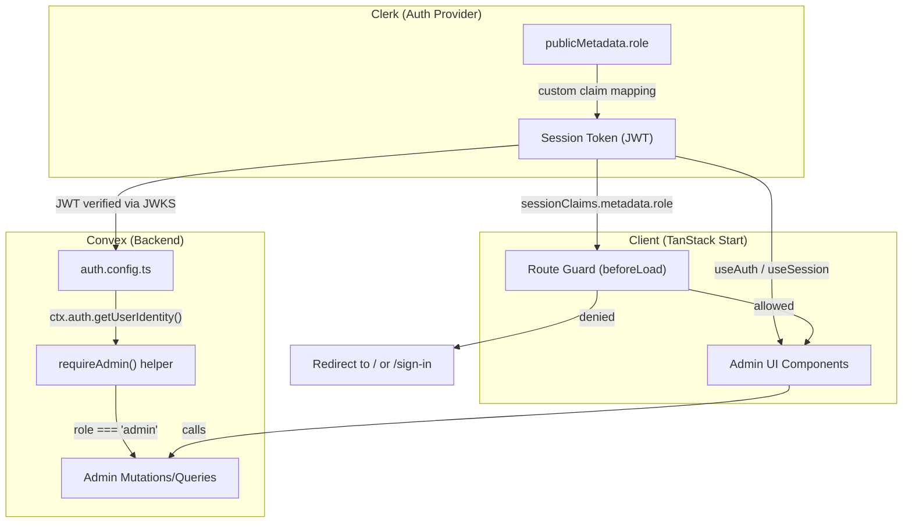

# Design Document: Role-Based Access Control

## Overview

This design implements Role-Based Access Control (RBAC) for Bullshit Corner, distinguishing between two roles: **General User** (default) and **Admin**. The role is sourced from Clerk's `publicMetadata.role`, propagated to Convex via a custom JWT claim in the session token, and enforced at three layers:

1. **Client-side route protection** — TanStack Router `beforeLoad` guards on `/admin` routes
2. **Server-side authorization** — A shared Convex helper that verifies the `role` claim from `ctx.auth.getUserIdentity()` before executing privileged mutations/queries
3. **UI gating** — Conditional rendering of admin navigation based on the session's role claim

The approach avoids caching roles in the Convex `users` table; the JWT claim is authoritative on every request. Role changes in Clerk's dashboard propagate on the next token refresh (~60s) with zero code deploys.

## Architecture



### Key Design Decisions

| Decision | Rationale |
|----------|-----------|
| Role stored in Clerk `publicMetadata` only | Single source of truth; can't be modified client-side; no sync drift with Convex |
| Custom claim in session token (not JWT template) | Uses Clerk's built-in session token customization; no separate "convex" JWT template needed since the existing setup already configures `aud: "convex"` |
| Shared `requireAdmin()` helper | DRY; consistent error codes; easy to grep for all admin-gated functions |
| No role column in `users` table | Avoids stale cache; JWT is authoritative per-request per Requirement 7.3 |
| Layout route for `/admin` path prefix | Single `beforeLoad` guard covers all admin sub-routes; clean code-splitting boundary |

## Components and Interfaces

### 1. Clerk Session Token Configuration (Dashboard)

Custom claims added to the session token via Clerk Dashboard → Sessions → Customize session token:

```json
{
  "metadata": "{{user.public_metadata}}"
}
```

This maps the entire `publicMetadata` object into the JWT under a `metadata` key. On the Convex side, `ctx.auth.getUserIdentity()` exposes this as a custom claim accessible via the identity object. The role is then read as `identity.metadata?.role`.

> **Note:** Clerk's Convex integration already sets `aud: "convex"` by default. The custom claims editor simply adds the `metadata` shortcode on top of the existing configuration.

### 2. Convex Auth Helper (`convex/lib/auth.ts`)

```typescript
// convex/lib/auth.ts
import { ConvexError } from 'convex/values'
import type { QueryCtx, MutationCtx } from '../_generated/server'

type AuthCtx = QueryCtx | MutationCtx

/**
 * Verifies the caller is authenticated and has the "admin" role.
 * Throws distinguishable ConvexErrors for unauthenticated vs unauthorized.
 */
export async function requireAdmin(ctx: AuthCtx) {
  const identity = await ctx.auth.getUserIdentity()

  if (!identity) {
    throw new ConvexError({ code: 'UNAUTHENTICATED', message: 'Sign in required.' })
  }

  const role = (identity as any).metadata?.role
  if (role !== 'admin') {
    throw new ConvexError({ code: 'FORBIDDEN', message: 'Admin access required.' })
  }

  return identity
}

/**
 * Returns the role string for the current user, or null if unauthenticated.
 * Does NOT throw — used for conditional logic rather than gating.
 */
export async function getUserRole(ctx: AuthCtx): Promise<string | null> {
  const identity = await ctx.auth.getUserIdentity()
  if (!identity) return null
  return (identity as any).metadata?.role ?? 'general_user'
}
```

### 3. Route Guard (`src/routes/_app/admin.tsx` — layout route)

```typescript
// src/routes/_app/admin.tsx
import { auth } from '@clerk/tanstack-react-start/server'
import { createFileRoute, Outlet, redirect } from '@tanstack/react-router'

export const Route = createFileRoute('/_app/admin')({
  beforeLoad: async () => {
    if (typeof window === 'undefined') {
      // SSR: use Clerk server auth
      const { userId, sessionClaims } = await auth()
      if (!userId) {
        throw redirect({ to: '/sign-in' })
      }
      const role = (sessionClaims as any)?.metadata?.role
      if (role !== 'admin') {
        throw redirect({ to: '/' })
      }
    }
    // CSR: Clerk's useAuth/useSession handles redirect via the component
  },
  component: AdminLayout,
})
```

Client-side guard (inside the layout component) uses `useSession()` to check `session.publicUserData` or `useUser()` to read `user.publicMetadata.role`. If the role doesn't match, a client-side redirect fires. This double-guard (SSR + CSR) ensures neither path is bypassed.

### 4. Admin Convex Functions

#### Leaderboard Management (`convex/admin/topics.ts`)

| Function | Type | Purpose |
|----------|------|---------|
| `list` | `query` | List all topics with full details (for admin editing) |
| `create` | `mutation` | Insert a new topic at a given ranking |
| `update` | `mutation` | Patch topic fields (title, description, youtubeUrl, submittedBy) |
| `reorder` | `mutation` | Move a topic from position A to B, re-ranking affected topics |
| `remove` | `mutation` | Delete a topic and close ranking gaps |

All functions call `requireAdmin(ctx)` as their first operation.

#### Submission Review (`convex/admin/submissions.ts`)

| Function | Type | Purpose |
|----------|------|---------|
| `list` | `query` | Paginated list of unchosen submissions (desc by submittedAt) |
| `listChosen` | `query` | Paginated list of previously chosen submissions |
| `markChosen` | `mutation` | Set `chosenAt` + `chosenBy` on a submission |
| `unmarkChosen` | `mutation` | Clear `chosenAt` + `chosenBy` from a submission |

### 5. Route Structure

```
src/routes/
  _app/
    admin.tsx                 ← layout route with beforeLoad guard
    admin/
      index.tsx               ← admin dashboard (redirect to leaderboard)
      leaderboard.tsx         ← leaderboard CRUD interface
      submissions.tsx         ← submission review with chosen/unchosen tabs
```

### 6. UI Component Architecture

```
src/components/admin/
  admin-nav.tsx               ← sidebar/tab nav for admin sections
  topic-form.tsx              ← create/edit topic form (shared)
  topic-list-item.tsx         ← draggable list item for reordering
  submission-card.tsx         ← submission entry with "choose" action
  submission-filters.tsx      ← tab toggle: available / chosen
```

The admin layout renders a secondary nav (tabs or sidebar) above the `<Outlet />`. Each admin page uses TanStack Query with `convexQuery()` for real-time data and `useConvexMutation()` for writes.

## Data Models

### Schema Changes (`convex/schema.ts`)

The `submissions` table gains two optional fields:

```typescript
submissions: defineTable({
  userId: v.id('users'),
  topic: v.string(),
  details: v.optional(v.string()),
  submittedBy: v.optional(v.string()),
  submittedAt: v.number(),
  // ─── New RBAC fields ───
  chosenAt: v.optional(v.number()),
  chosenBy: v.optional(v.id('users')),
})
  .index('by_submittedAt', ['submittedAt'])
  .index('by_userId', ['userId'])
  // New compound index for filtering chosen vs unchosen
  .index('by_chosenAt_and_submittedAt', ['chosenAt', 'submittedAt'])
```

**Design note on the index:** `by_chosenAt_and_submittedAt` enables efficient queries:
- Unchosen submissions: `.withIndex('by_chosenAt_and_submittedAt', q => q.eq('chosenAt', undefined))` — not directly possible since Convex doesn't support `eq(field, undefined)`. Instead, we query `by_submittedAt` with a post-filter `.filter(q => q.eq(q.field('chosenAt'), undefined))` for the unchosen view.
- Alternative: Add a boolean `isChosen` field (default `false`) and index on `['isChosen', 'submittedAt']` for efficient range queries.

**Revised approach — add `isChosen` boolean:**

```typescript
submissions: defineTable({
  userId: v.id('users'),
  topic: v.string(),
  details: v.optional(v.string()),
  submittedBy: v.optional(v.string()),
  submittedAt: v.number(),
  chosenAt: v.optional(v.number()),
  chosenBy: v.optional(v.id('users')),
  isChosen: v.optional(v.boolean()), // false or undefined = not chosen
})
  .index('by_submittedAt', ['submittedAt'])
  .index('by_userId', ['userId'])
  .index('by_isChosen_and_submittedAt', ['isChosen', 'submittedAt'])
```

This lets us efficiently query:
- Unchosen: `.withIndex('by_isChosen_and_submittedAt', q => q.eq('isChosen', false)).order('desc').paginate(...)`
- Chosen: `.withIndex('by_isChosen_and_submittedAt', q => q.eq('isChosen', true)).order('desc').paginate(...)`

**Migration note:** Existing submissions have no `isChosen` field. A one-time migration sets `isChosen: false` on all existing rows so the index covers them. Alternatively, treat `undefined` as `false` in application logic and backfill lazily.

### No Changes to `users` Table

Per Requirement 7.3, roles are NOT stored in the Convex `users` table. The `chosenBy` field references the admin's user ID for audit purposes only — it's not used for authorization decisions.

## Correctness Properties

*A property is a characteristic or behavior that should hold true across all valid executions of a system — essentially, a formal statement about what the system should do. Properties serve as the bridge between human-readable specifications and machine-verifiable correctness guarantees.*

### Property 1: Unauthenticated callers cannot execute admin functions

*For any* Convex function guarded by `requireAdmin()`, if the caller has no valid authentication token (i.e., `ctx.auth.getUserIdentity()` returns `null`), the function SHALL throw a `ConvexError` with code `"UNAUTHENTICATED"` and perform no database reads or writes beyond the identity check.

**Validates: Requirements 3.2**

### Property 2: Non-admin authenticated callers cannot execute admin functions

*For any* Convex function guarded by `requireAdmin()` and *for any* authenticated identity whose `metadata.role` is not equal to `"admin"` (including `undefined`, `null`, `"general_user"`, or any arbitrary string), the function SHALL throw a `ConvexError` with code `"FORBIDDEN"` and perform no database reads or writes beyond the identity check.

**Validates: Requirements 3.3, 1.3, 1.5**

### Property 3: Admin callers pass the guard and execute the function body

*For any* Convex function guarded by `requireAdmin()` and *for any* authenticated identity whose `metadata.role` equals `"admin"`, the function SHALL NOT throw an authorization error and SHALL proceed to execute its core logic.

**Validates: Requirements 3.1, 1.4**

### Property 4: Reorder preserves contiguous ranking with no gaps or duplicates

*For any* leaderboard state with N topics and *for any* valid move operation (moving topic at position A to position B where 1 ≤ A, B ≤ N), after the reorder mutation completes, the resulting rankings SHALL form a contiguous sequence from 1 to N with no duplicates and no gaps.

**Validates: Requirements 4.3**

### Property 5: Remove closes ranking gaps

*For any* leaderboard state with N topics (N ≥ 1) and *for any* topic removal, after the remove mutation completes, the resulting rankings SHALL form a contiguous sequence from 1 to N-1 with no gaps.

**Validates: Requirements 4.4**

### Property 6: Marking a submission as chosen excludes it from default view

*For any* submission in the pool, after `markChosen` is called on it, querying the default (unchosen) submission list SHALL NOT include that submission, and querying the chosen list SHALL include it.

**Validates: Requirements 5.2, 5.4**

### Property 7: Unmarking a chosen submission returns it to the pool

*For any* previously chosen submission, after `unmarkChosen` is called on it, querying the default (unchosen) submission list SHALL include that submission, and querying the chosen list SHALL NOT include it.

**Validates: Requirements 5.6**

### Property 8: Title validation rejects empty and oversized titles

*For any* string that is empty (after trimming) or exceeds 200 characters, the topic create/update mutation SHALL reject the operation with a validation error.

**Validates: Requirements 4.6**

## Error Handling

| Scenario | Layer | Behavior |
|----------|-------|----------|
| Unauthenticated user visits `/admin/*` | Route Guard (SSR) | Redirect to `/sign-in` |
| Authenticated non-admin visits `/admin/*` | Route Guard (SSR) | Redirect to `/` |
| Unauthenticated API call to admin function | Convex | `ConvexError { code: "UNAUTHENTICATED" }` |
| Non-admin API call to admin function | Convex | `ConvexError { code: "FORBIDDEN" }` |
| Invalid topic title (empty or >200 chars) | Convex mutation | `ConvexError` with descriptive message |
| `markChosen` on already-chosen submission | Convex mutation | No-op (idempotent) or return early |
| Network failure on admin action | Client UI | Toast/error message; submission stays in list unchanged (Req 5.3) |
| Clerk session expired during admin session | Route Guard (CSR) | Redirect to `/sign-in` on next navigation |

### Error Code Convention

Admin functions use structured `ConvexError` payloads:

```typescript
throw new ConvexError({ code: 'UNAUTHENTICATED', message: '...' })
throw new ConvexError({ code: 'FORBIDDEN', message: '...' })
throw new ConvexError({ code: 'VALIDATION_ERROR', message: '...' })
throw new ConvexError({ code: 'NOT_FOUND', message: '...' })
```

Client components can switch on `error.data.code` to show appropriate UI feedback.

## Testing Strategy

### Unit Tests (convex-test + vitest)

| Test Category | Approach |
|---------------|----------|
| `requireAdmin()` helper | Mock `ctx.auth.getUserIdentity()` with various identity shapes; verify correct error codes thrown |
| Topic CRUD mutations | Create/update/remove topics; assert DB state after each operation |
| Reorder logic | Set up N topics, perform moves, verify contiguous rankings |
| Submission chosen/unchosen | Mark/unmark submissions; verify index-based queries return correct sets |
| Title validation | Empty strings, whitespace-only, 201-char strings → expect ConvexError |

### Property-Based Tests (fast-check + vitest)

Property-based testing is appropriate here because:
- The authorization helper has universal properties across all possible identity shapes
- Reorder/remove logic must preserve ranking invariants across arbitrary leaderboard sizes and move patterns
- Input validation must correctly reject all strings matching certain criteria

**Library:** `fast-check` (most popular JS PBT library, pairs well with vitest)

**Configuration:** Minimum 100 iterations per property test.

Each property test references its design document property:
- **Feature: role-based-access, Property 1:** Unauthenticated callers rejected
- **Feature: role-based-access, Property 2:** Non-admin callers rejected
- **Feature: role-based-access, Property 3:** Admin callers pass
- **Feature: role-based-access, Property 4:** Reorder preserves contiguous rankings
- **Feature: role-based-access, Property 5:** Remove closes gaps
- **Feature: role-based-access, Property 6:** markChosen excludes from default view
- **Feature: role-based-access, Property 7:** unmarkChosen returns to pool
- **Feature: role-based-access, Property 8:** Title validation

### Integration / E2E Tests

| Test | Approach |
|------|----------|
| Route guard redirects | Navigate to `/admin` as non-admin; assert redirect to `/` |
| Full admin flow | Sign in as admin, create topic, verify it appears in leaderboard |
| Role change propagation | Revoke admin role, verify next page load redirects away |

These are example-based (not PBT) since they test external service integration and UI rendering.
