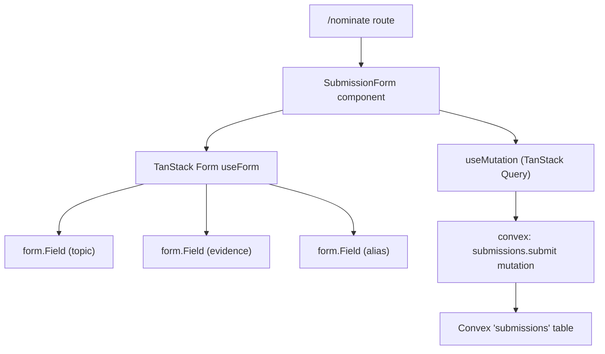

# Design Document: topic-submission

## Overview

The topic-submission feature adds a publicly accessible form to the Bullshit Corner site that lets viewers nominate debate topics without signing in. Submitted topics are stored in a new `submissions` Convex table — separate from the curated `topics` leaderboard — where they await host review.

The form is built with **TanStack Form v1** (native field validators, no schema adapter), wired to **shadcn/ui** `Input` and `Textarea` primitives, and submits via a **public Convex mutation** that requires no authentication. Styling follows **Tailwind CSS v4** conventions.

---

## Architecture

The feature is entirely client-side from a routing perspective: a new route (`/nominate`) renders the `SubmissionForm` component, which calls the Convex `submissions.submit` mutation through TanStack Query's `useMutation`. No server functions or SSR loader are needed — the form has no initial data to load.



**Data flow on submit:**
1. `form.handleSubmit` fires; TanStack Form runs all field validators synchronously.
2. If any field is invalid, submission is blocked and errors are displayed inline.
3. On valid submit, the `onSubmit` callback normalizes the values (trim, alias fallback) and calls `mutateAsync`.
4. While in-flight, the submit button is disabled with a loading indicator.
5. On success, `form.reset()` clears all fields and a success message is shown.
6. On error, the error message is displayed; field values are preserved.

---

## Components and Interfaces

### New route: `src/routes/nominate.tsx`

A TanStack Router file route. No loader needed (no data to prefetch). Renders a page shell (`SiteHeader`, `SiteFooter`) and the `SubmissionForm` component.

```typescript
export const Route = createFileRoute('/nominate')({
  component: NominateTopicPage,
})
```

### New component: `src/components/submission-form.tsx`

Client-only component. Owns the TanStack Form instance and mutation state.

**Props:** none — fully self-contained.

**Internal state managed by TanStack Form:**
- `topic: string` — required, trimmed before submit, max 200 chars
- `evidence: string` — optional, trimmed before submit, max 2000 chars
- `alias: string` — optional, substituted with `"Anonymous Viewer"` when blank/whitespace-only, max 100 chars

**Submission state (outside TanStack Form):**
- `submitStatus: 'idle' | 'success' | 'error'` — drives success/error banner visibility
- `submitError: string | null` — the human-readable error message from a failed mutation

### TanStack Form wiring

```typescript
const form = useForm({
  defaultValues: {
    topic: '',
    evidence: '',
    alias: '',
  },
  onSubmit: async ({ value }) => {
    const topic = value.topic.trim()
    const evidence = value.evidence.trim() || undefined
    const submittedBy = value.alias.trim() || 'Anonymous Viewer'
    await mutateAsync({ topic, evidence, submittedBy })
    form.reset()
    setSubmitStatus('success')
  },
})
```

Each `<form.Field>` uses `validators.onChange` (or `onBlur` for the topic required check) to return inline error strings.

### New Convex function: `convex/submissions.ts`

```typescript
export const submit = mutation({
  args: {
    topic: v.string(),
    evidence: v.optional(v.string()),
    submittedBy: v.string(),
  },
  handler: async (ctx, args) => { ... }
})
```

The mutation validates argument lengths server-side (defensive guard against clients that bypass client-side validation), inserts the document with `submittedAt: Date.now()`, and returns the new document `_id`.

### shadcn/ui components needed

The following shadcn/ui components must be installed before implementation (they are not yet in `src/components/ui/`):

```bash
pnpm dlx shadcn@latest add input textarea button label
```

These are wired into each `<form.Field>` render prop. The `field.handleChange` / `field.handleBlur` values from TanStack Form's `FieldApi` are passed directly as `onChange` / `onBlur` props.

---

## Data Models

### Convex schema addition — `submissions` table

Add to `convex/schema.ts`:

```typescript
submissions: defineTable({
  topic:       v.string(),
  evidence:    v.optional(v.string()),
  submittedBy: v.string(),
  submittedAt: v.number(),
}).index('by_submittedAt', ['submittedAt']),
```

**Field rationale:**
| Field | Type | Notes |
|---|---|---|
| `topic` | `v.string()` | Required, pre-trimmed by client, max 200 chars enforced in mutation |
| `evidence` | `v.optional(v.string())` | Omitted entirely when empty (not stored as empty string) |
| `submittedBy` | `v.string()` | Always present; defaults to `"Anonymous Viewer"` before mutation call |
| `submittedAt` | `v.number()` | Server-side `Date.now()` — not supplied by client |

The `by_submittedAt` index supports chronological listing by hosts without a table scan.

### Mutation validation constants

Shared between client validators and the Convex mutation via a constants module:

```typescript
// src/lib/submission-constants.ts
export const SUBMISSION_LIMITS = {
  topic:    200,
  evidence: 2000,
  alias:    100,
} as const
```

The Convex mutation imports the same numeric values (or duplicates them — Convex functions can't import from `src/`). To avoid drift, the constants are co-located as a simple inline object in both the form component and the Convex file. The values are small enough that duplication is preferable to a cross-boundary import.

---

## Correctness Properties

*A property is a characteristic or behavior that should hold true across all valid executions of a system — essentially, a formal statement about what the system should do. Properties serve as the bridge between human-readable specifications and machine-verifiable correctness guarantees.*

---

### Prework Analysis

**Req 2.1/2.2 — Topic required validation:**
This is a universal rule that should hold for all possible string inputs, not just a single example. The validator is a pure function `(value: string) => string | undefined`. We can generate arbitrary strings and verify the output. The interesting boundary is "contains at least one non-whitespace character."
Classification: PROPERTY

**Req 2.5 — Alias fallback:**
The substitution rule (`whitespace-only → "Anonymous Viewer"`) applies to all possible alias strings. We can generate random strings and verify the transformation. This is a pure function with clear domain/range.
Classification: PROPERTY

**Req 3.1 — Submission data normalization:**
The full normalization (trim topic, trim evidence or omit, trim alias or fallback) is a pure transformation on form values. It can be extracted as a standalone function and tested with generated inputs.
Classification: PROPERTY (combined with 2.5 into one normalization property)

**Req 6.1–6.3 — Client length validators:**
The length check validator is a pure function `(value: string, max: number) => string | undefined`. The behavior varies with input length. This is PBT-ideal.
Classification: PROPERTY

**Req 6.4–6.6 — Server mutation length guards:**
The server mutation should reject inputs exceeding max lengths. This can be tested with `convex-test` + generated strings. The behavior varies with input length.
Classification: PROPERTY

**Property Reflection:**
- Req 2.1 (empty topic → error) and 2.2 (non-whitespace topic → no error) are two sides of the same validator function: consolidate into Property 1.
- Req 2.5 (alias whitespace fallback) and Req 3.1 (full normalization) overlap: normalization subsumes the alias check. Consolidate into Property 2.
- Req 6.1–6.3 (client length validators) and 6.4–6.6 (server length guards) test the same numeric boundary — one property covers the shape, parameterized over all three fields. Consolidate into Property 3.
- After reflection: 3 distinct, non-redundant properties.

---

### Property 1: Topic validator correctly partitions valid and invalid inputs

*For any* string value supplied to the topic validator, the validator SHALL return an error string when the value contains no non-whitespace characters (empty or whitespace-only), and SHALL return `undefined` (no error) when the value contains at least one non-whitespace character.

**Validates: Requirements 2.1, 2.2**

---

### Property 2: Submission normalization is deterministic and correct

*For any* combination of `topic`, `evidence`, and `alias` string values, the `normalizeSubmission` transformation function SHALL produce an object where: `topic` is the trimmed input; `evidence` is the trimmed input when it contains non-whitespace characters, and is `undefined` otherwise; `submittedBy` is the trimmed alias when it contains non-whitespace characters, and is `"Anonymous Viewer"` otherwise.

**Validates: Requirements 2.5, 3.1**

---

### Property 3: Length validators and mutation guards enforce field length limits

*For any* string value that exceeds the field's configured maximum length, the client-side length validator SHALL return a non-empty error string; conversely, *for any* string at or below the maximum length, it SHALL return `undefined`. The same boundary SHALL hold in the Convex mutation: inputs exceeding the limit SHALL cause the mutation to throw a `ConvexError`, and inputs within the limit SHALL be accepted.

**Validates: Requirements 6.1, 6.2, 6.3, 6.4, 6.5, 6.6**

---

## Error Handling

### Client-side validation errors

- TanStack Form surfaces errors via `field.state.meta.errors` (an array of all active error strings for that field).
- Each field renders its error below the input, only when `field.state.meta.isTouched` is true (errors don't flash on page load).
- Topic field errors: "Please enter a topic" (required), "Topic must be 200 characters or fewer" (length).
- Evidence field errors: "Evidence must be 2,000 characters or fewer" (length only — field is optional).
- Alias field errors: "Name must be 100 characters or fewer" (length only — field is optional).

### Mutation errors

- `useMutation` error is caught in `form`'s `onSubmit` via try/catch around `mutateAsync`.
- On catch, `setSubmitStatus('error')` and `setSubmitError(err.message)` are called.
- The error banner displays the message; field values are **not** reset, so the viewer can correct and retry.
- `ConvexError` thrown by the mutation (e.g. length guard exceeded) has a `.data` property — the UI extracts a human-readable message from it.

### Network / unknown errors

- If the Convex mutation throws a non-`ConvexError` (network outage, etc.), the error message falls back to a generic "Something went wrong. Please try again."
- The submit button is re-enabled after a failed submission.

---

## Testing Strategy

### Unit tests (example-based)

Co-located test files using **Vitest** (already available as the project's test runner via Vite).

Targets:
- `normalizeSubmission(values)` — concrete examples: empty alias, whitespace alias, whitespace evidence, normal values
- `topicValidator(value)` — specific examples: empty string, single space, valid string
- `lengthValidator(value, max)` — specific examples: string at exactly the max, one over, one under

### Property-based tests (for Correctness Properties 1–3)

Library: **[fast-check](https://fast-check.dev/)** (MIT license, well-maintained, works with Vitest).

Configuration: each property test runs **100 iterations minimum** (fast-check default is 100; explicitly set via `{ numRuns: 100 }`).

Each test is tagged with a comment referencing its design property:

```typescript
// Feature: topic-submission, Property 1: Topic validator correctly partitions valid and invalid inputs
it.prop([fc.string()])('topic validator rejects whitespace-only strings', (value) => {
  const isAllWhitespace = value.trim().length === 0
  const result = validateTopic(value)
  if (isAllWhitespace) {
    expect(result).toBeTypeOf('string') // error message
  } else {
    expect(result).toBeUndefined()
  }
}, { numRuns: 100 })
```

**Property 1** — Vitest + fast-check, pure function test, no external deps.

**Property 2** — Vitest + fast-check, pure function test on `normalizeSubmission`, no external deps.

**Property 3 (client side)** — Vitest + fast-check, pure function test on `validateLength`.

**Property 3 (server side)** — `convex-test` + Vitest + fast-check, tests the `submissions.submit` mutation handler with generated strings that exceed/meet limits.

### Convex integration tests

Using `convex-test` with `@edge-runtime/vm`:

- Happy path: submit valid data, verify document exists in `submissions` table.
- Server-side length guard: submit topic exceeding 200 chars, expect `ConvexError`.
- `submittedAt` is server-generated: verify the stored value is a number close to `Date.now()`.
- `evidence` omitted when empty: submit with `evidence: undefined`, verify field is absent on stored doc.

### Manual / smoke tests

- Verify form renders on `/nominate` route.
- Verify success banner appears and form resets after submission.
- Verify error banner appears and fields are preserved on network failure.
