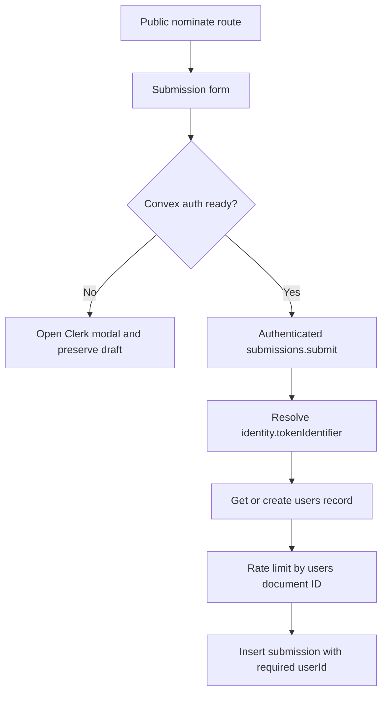

# Design Document: topic-submission

## Overview

The nomination page is public, but writing a submission is authenticated. Clerk owns sign-in and account UI; Convex validates Clerk JWTs and remains the authorization boundary. A normalized Convex `users` record owns each submission, while the optional alias remains an unverified display pseudonym.

This document supersedes the original anonymous/email-based submission design.

## Architecture



The root provider hierarchy is:

```text
ClerkProvider
└── ConvexProviderWithClerk (shared ConvexReactClient, Clerk useAuth)
    ├── SyncUser
    └── route content
```

For SSR and loaders, the root `beforeLoad` calls a TanStack Start server function. It reads Clerk auth, requests a token with the `convex` template when the current session token does not already target the `convex` audience, and sets it on `ConvexQueryClient.serverHttpClient` before child loaders execute. Signed-out requests set no token and continue normally.

## Data models

### `users`

```typescript
users: defineTable({
  tokenIdentifier: v.string(),
  clerkId: v.string(),
  email: v.optional(v.string()),
  name: v.optional(v.string()),
  imageUrl: v.optional(v.string()),
  updatedAt: v.number(),
}).index('by_tokenIdentifier', ['tokenIdentifier'])
```

`tokenIdentifier` is the canonical identity key. Email and profile claims are private user data and are never copied onto submissions.

### `submissions`

```typescript
submissions: defineTable({
  userId: v.id('users'),
  topic: v.string(),
  evidence: v.optional(v.string()),
  submittedBy: v.optional(v.string()),
  submittedAt: v.number(),
})
  .index('by_submittedAt', ['submittedAt'])
  .index('by_userId', ['userId'])
```

## Submission flow

1. TanStack Form validates the public draft.
2. If Convex auth is not ready, the submit button remains disabled.
3. If signed out, submit opens Clerk's modal and does not call Convex.
4. The draft remains mounted while the modal is open.
5. After auth succeeds, the user clicks Submit Topic again to confirm.
6. Convex verifies identity and calls the shared user get-or-create helper.
7. The rate limiter consumes one of six weekly submissions for that user ID.
8. Convex stores the normalized submission and server timestamp.
9. Success resets the form; errors preserve it.

## User synchronization

`SyncUser` runs below `ConvexProviderWithClerk` only after Convex confirms authentication. It keys its guard by Clerk user and session, retries transient failures with bounded exponential delays, and relies on the server's tokenIdentifier-based mutation for idempotency. The submission mutation uses the same helper, so submission does not depend on the client effect winning a race.

## Security properties

- Public routing is not treated as an authorization boundary.
- Convex derives ownership server-side and accepts no client user ID or email.
- `submittedBy` is an optional pseudonym, not verified identity.
- Authenticated data is never exposed by a public list query.
- SSR and browser token paths use the same Convex audience/template behavior.

## Testing

Focused `convex-test` coverage verifies:

- unauthenticated `getMe` returns `null`;
- unauthenticated sync and submission are rejected;
- repeated sync produces one user record;
- first submission creates/owns the user record;
- email is absent from submissions;
- blank alias is omitted;
- each user is limited to six submissions per week.

Manual browser smoke testing should additionally verify responsive header controls, Clerk modal behavior, draft retention, and the final authenticated submission flow.
